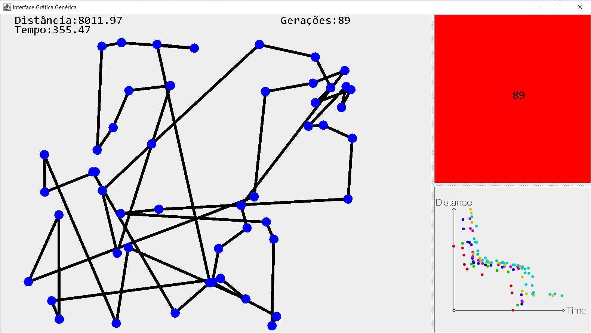
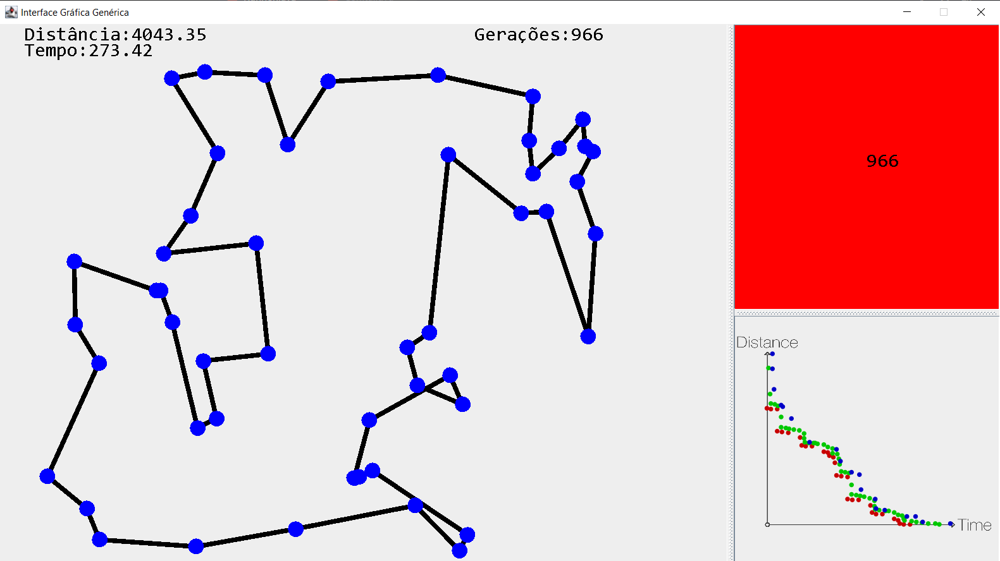

# Problema do Caixeiro-Viajante usando Algoritmo Genético Multi-Objetivo

O código utiliza interface gráfica para demonstrar a aplicação do Algoritmo Genético Multi-Objeito para encontrar soluções para o problema do Caixeiro-Viagente. Para as métricas conflitantes, são utilizadas a distância e o tempo de viagem total.

As rotas que interligam as cidades apresentam diferentes valores de velocidade máxima. Com isso, temos dois objetivos que precisam de otimizados em conjunto. A representação das frentes de pareto demonstram esse conflito.

A inspiração para o projeto foi tirada de uma playlist do youtube, no canal [Tutorials with Gary](https://www.youtube.com/watch?v=vg1FTkWHNSg&list=PLL61h44ln0J0Pbs2EPR71wn-8wvwxHI9z).

## Visualização do projeto.

## Apresentação em PDF

Minhas redes sociais:

